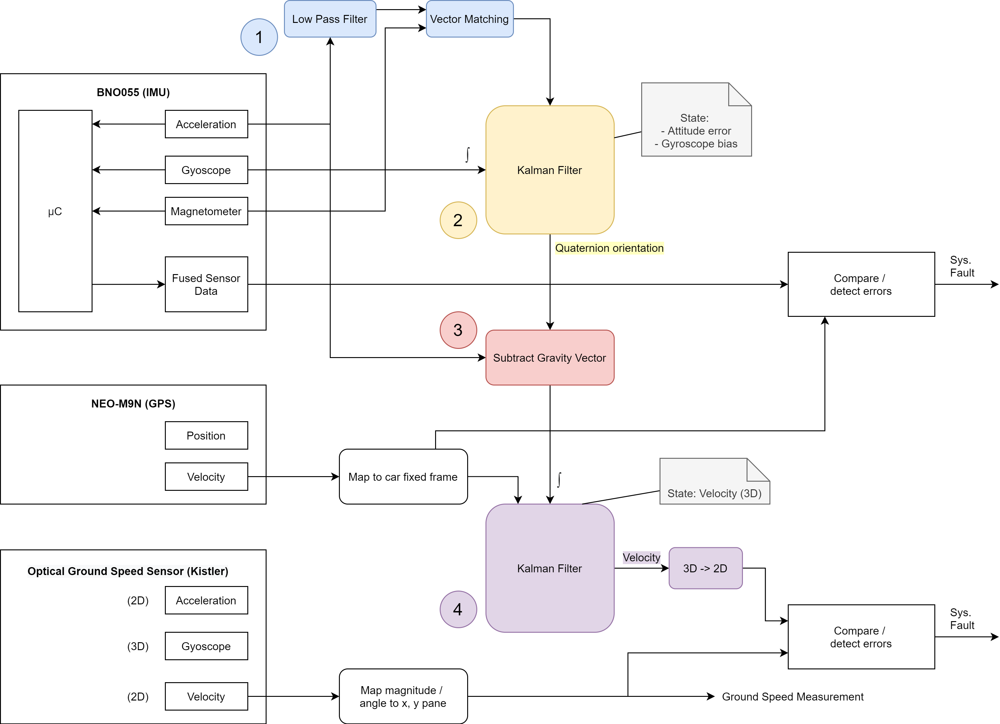
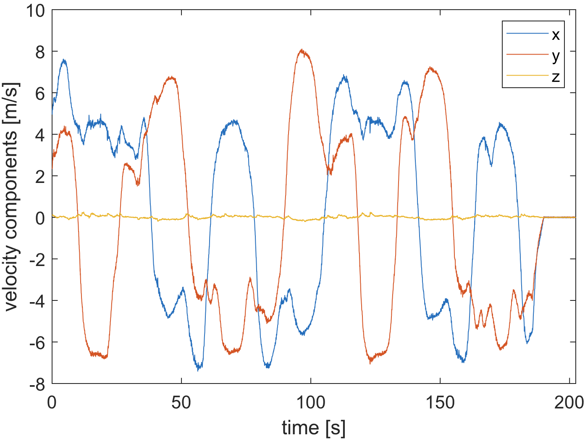
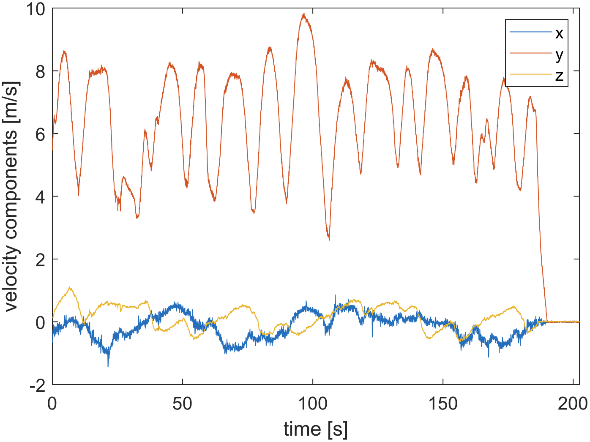
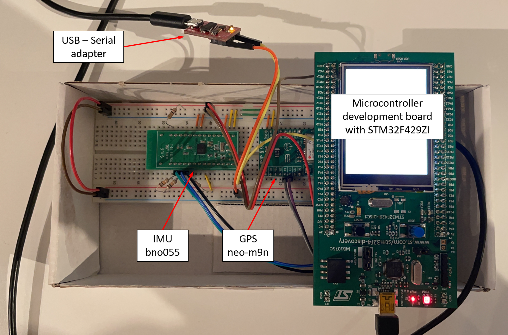

# Ground Speed Measuring System (GSMS)

| Author | Institution | Date |
|:---|:---|:---|
| Etienne Gubler | Zurich University of Applied Sciences | Sept. 2020 - Dec. 2020 |

## Description

Ground speed measuring system (GSMS) for electric race car based on **sensor fusion** using an **IMU** (Accelerometer, Gyroscope and Magnetometer) and a **GPS**. The sensor data is fused using a cascade of two **Kalman filters**. Implemented on an STM32F4 using bare metal programming in **C/C++**. The data processing code and filters were first implemented and tested in **MATLAB**.

## Project Structure

- Project report: [GSMS_Project-Report.pdf](./docs/report/GSMS_Project-Report.pdf)
- Keil &mu;Vison IDE project root: [keil/](./keil/)
- Main srouce file: [app_main.c](./keil/app/app_main.c)

## Key Figures from the Report

### Sensor Fusion Diagram

### GPS Velocity Components

### Rotated GPS Velocity Components

### Experimental Setup

